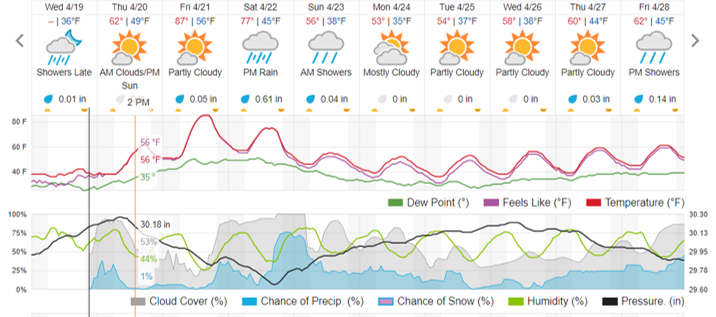

### Reminders and Upcoming Dates

- **Evaluations are VERY Important:**

  - **[coursefeedback.syr.edu](http://coursefeedback.syr.edu/)**
  
  - I will end class 5 min. early today and next Thursday to give you time to complete evaluations in class. 
  - Please complete evaluations for **ALL** courses.

- **HW 10 is due Monday, 4/24**

- **Optional Lecture on 4/25**

  - Developing R Functions for Time Series Analysis
  
- **Course Review on 4/27 (Required)** 

---

### Reminder of Using R and R Markdown Files

- Download Zipped R project 

- Open Zipped folder and copy internal folder (R Project) to a BUA 345 folder on your computer NOT IN DOWLOADS

- **Open R Project:**
  
  - *OPTION 1:* Click on .Rproj file to open project and RStudio

  - *OPTION 2:* Open RStudio, then click File > Open Project > then navigate to  and click on .Rproj file.
  

- **Once Project is opened in RStudio:**

  - Click on `code_data_output` file to open it.

  - Click on `BUA_345_Lecture_23.Rmd` to open it.

  - Run `setup` Chunk

---

### Setup

- The setup chunk shows the packages needed for this demo.   

- R will install specified packages if needed (only required once after R is installed)  

- R will load specified packaged (required every time you start a new R session)  

- The first time you run this code, R will install these packages which will be slow.  

- **If you get warnings, that's okay.**  

- If you get **error messages**, I (or TA), can help you.

---

### Setup Chunk for Lecture 23

```{r setup for Lecture 23, include = T}

# this line specifies options for default options for all R Chunks
knitr::opts_chunk$set(echo=T, highlight=T)
# suppress scientific notation
options(scipen=100)

# install helper package that loads and installs other packages, if needed
if (!require("pacman")) install.packages("pacman", repos = "http://lib.stat.cmu.edu/R/CRAN/")

# install and load required packages
pacman::p_load(pacman,tidyverse, magrittr, knitr, gridExtra, forecast, tidyquant, lubridate, maps, usdata, mapproj, ggthemes, RColorBrewer, dygraphs, climate)

# verify packages - it's a long list
p_loaded()

```

**NOTES:**

- Please make sure you can open the provided R project for the practice questions and run the setup chunk without errors.
- If you are having trouble installing/loading any packages, please come to office hour or make an appointment with me or course TA.

---

### Plan for Today

- **Review of Time Series Concepts**

  - **Redemption for Syracuse!**
  
  - Review and New Terminology
  
- Review of Time Series without Seasonality

- Seasonality in Time Series Data

- Forecasting Trends with Seasonality in R

  - Example from HW 10: Alaska 
  - Data in HW 10 end in Q4 of 2021
  - Data in Lecture 23 end in Q4 of 2022
 
#### HW Assignment 10

  - **Today:** Questions 7 - 10 
  
---
  
#### Cross-Sectional Data

- Shows a Snapshot of One Time Period

```{r message = FALSE, fig.align='center'}

gsb23 <- read_csv("gsb_23.csv", show_col_types = F, skip=25, 
                  col_select = c(1,2,6), ) |>
  slice(1:5) |>
  rename("city" = "...1", 
         "2022-23" = "...2", 
         "Most" = "...6") |> 
  
  mutate(Most = substr(Most, 1,5) |> as.numeric()) 

gsb_long <- gsb23 |> pivot_longer(cols = `2022-23`:Most, 
                               names_to = "type",
                               values_to = "inches") 
(gsb_plt <- gsb_long |>
  ggplot() +
  geom_bar(aes(x=city, y=inches, fill=type),
                stat="identity", position="dodge") +
  scale_fill_manual(values=c("blue4", "lightblue")) +
  theme_classic() +
  labs(fill="", x="City", y="Snowfall (inches)",
       caption="Data Source: https://goldensnowball.com/",
       title="City Snowfall - Current and All-time Record")+ 
  theme(plot.title = element_text(size = 15),
        plot.caption = element_text(size = 10),
        axis.title.x = element_text(size = 15),
        axis.title.y = element_text(size = 15),
        axis.text.x = element_text(size = 8),
        axis.text.y = element_text(size = 15),
         plot.background = 
          element_rect(colour = "darkgrey", fill=NA, linewidth=2)))


```

---

#### Time Series Data

- Shows Trend over Time

```{r syr snowfall timeseries, message=F, fig.align='center'}

snowfall <- read_csv("snowfall_upstateny_cities.csv", 
                     show_col_types = F) |>
  filter(!Season=="Season") |>
  separate(Season, into=c("Season_Start", "Season_End"), sep = "-") |>
  mutate(Season_Start = Season_Start |> as.integer(),
         Season_End = Season_Start + 1 |> as.integer(),
         Syracuse = Syracuse |> as.numeric(), 
         Buffalo = Buffalo |> as.numeric()) |>
  rename("city_most" = "City With Most Snow") |>
  select(Season_End, Syracuse, Buffalo, city_most) |>
  filter(Season_End >= 1952) |>
  pivot_longer(cols=Syracuse:Buffalo, names_to = "City", values_to = "Snowfall") 
   
(line_plot <- snowfall |>
  ggplot() +
  geom_line(aes(x=Season_End, y=Snowfall, color=City), linewidth=1) +
  theme_classic() + 
  scale_x_continuous(breaks=seq(1960, 2020, 10)) + 
  scale_color_manual(values=c("lightblue", "blue")) +
  ylim(0,200) +
  
  labs(title="Syracuse Annual Snowfall", 
       y="Snowfall (inches)", 
       x="Year Season Ended", 
       caption="Data Source: https://en.wikipedia.org/wiki/Golden_Snowball_Award") + 
  theme(plot.title = element_text(size = 15),
        plot.caption = element_text(size = 10),
        axis.title.x = element_text(size = 15),
        axis.title.y = element_text(size = 15),
        axis.text.x = element_text(size = 10),
        axis.text.y = element_text(size = 15),
         plot.background = 
          element_rect(colour = "darkgrey", fill=NA, linewidth=2)))

```

---

### Time Series Terminology

--

- **auto-correlation:** A variable is correlated with itself
  
- **auto-regression (AR):** Using previous observations to predict into the future.
  
- **R function:** **`auto.arima` - ARIMA** is an acronym:

  - **AR:** auto-regressive - `p` = number of lags to minimize auto-correlation
  
  - **I:** integrated - `d` = order of differencing to achieve stationarity
  
  - **MA:** moving average - `q` = number of terms in moving average   
  
  - All 3 components are optimized to provide a reliable forecast.
  
---

### More on Stationarity

- **Stationary Time Series:**
 
  - Consistent mean and variance throughout time series
  
  - Time series with trends, or with seasonality, are not stationary.
  
  - Separating a time series into different parts is how we analyze it
  
    - This is called **DECOMPOSITION**
    
    - Time Series Modeling decomposes the data into:
    
      - Trend
      
      - Seasonality (repeated pattern)
      
      - Residuals (what's left over)
    
---

### Decomposition and SARIMA Models

#### **NEW TERM: SARIMA model**

  - Lecture 22: **ARIMA** models
  
  - Today: ARIMA models with **SEASONAL** component.
  
  - **SARIMA:** **S**easonal **A**uto-**R**egressive **I**ntegrated **M**oving **A**verage.

--

- **SARIMA** models: 

  - optimize `p`, `d`, and `q` for whole time series 

  - Also optimize `p`, `d`, and `q` within season (repeating intervals)

--

#### **Decomposition**

- ARIMA models are decomposed into 

  - Trend | Residuals
  
- SARIMA models are decomposed into

  - Trend | Seasonal patterns | Residuals

---

***NOTE: NETFLIX REVIEW MATERIAL NOT INCLUDED IN LECTURE 23 NOTES***

- See Lecture 22 notes.

---


### Seasonality - Not Just Seasons
- Seasonal periods can be days, months, seasons, decades, etc.
- Seasonality: repeating pattern of highs and lows of approx. equal timespans

#### **Example: Temperature data has a daily seasonal pattern:**

```{r echo=FALSE, fig.align='center', out.width="75%"}



```


---

### Seasonality - Not Just Seasons
- Seasonal periods can be days, months, seasons, decades, etc.
- Seasonality: repeating pattern of highs and lows of approx. equal timespans

#### Carbon Dioxide Trends - Monthly - 1958 to Present Day

```{r import co2 data, include=F, message=FALSE, results='hide'}
co2 <- read_csv("co2.csv") |>
  select(1,2,4,5) |>
  mutate(date=ymd(paste(yr,month,15))) |>
  glimpse()

# https://gml.noaa.gov/webdata/ccgg/trends/co2/co2_mm_mlo.txt

# https://gml.noaa.gov/dv/data/index.php?parameter_name=Carbon%2BDioxide&site=MLO%22

```

```{r co2 trends, message=F, fig.dim=c(10,5.5), fig.align='center'}

(co2_plot <- co2 |>
  ggplot() +
  geom_line(aes(x=date, y=mnth_avg), color="blue", linewidth=1) +
  theme_classic() +
  labs(title="Carbon Dioxide Measurements (1958 - 2023)", 
       subtitle="Monthly Data from Mauna Loa Observatory, Hawaii, USA",
       y="Carbon Dioxide (ppm)", 
       x="Date", 
       caption="Data Source: https://gml.noaa.gov/webdata/ccgg/trends/co2/co2_mm_mlo.txt") + 
  scale_x_date(breaks = "10 years", date_labels = "%Y") +
  theme(plot.title = element_text(size = 15),
        plot.caption = element_text(size = 8),
        axis.title.x = element_text(size = 15),
        axis.title.y = element_text(size = 15),
        axis.text.x = element_text(size = 10),
        axis.text.y = element_text(size = 15),
        plot.background = element_rect(colour = "darkgrey", fill=NA, linewidth=2)))


```

---

### Seasonality - Not Just Seasons
- Seasonal periods can be days, months, seasons, decades, etc.
- Seasonality: repeating pattern of highs and lows of approx. equal timespans

#### Carbon Dioxide - Monthly - 2014 to Present Day 

```{r recent co2 trends, message=F, fig.dim=c(10,5.5), fig.align='center'}
co2_1 <- co2 |> filter(yr >= 2014)

(co2_plot1 <- co2_1|>
  ggplot() +
  geom_line(aes(x=date, y=mnth_avg), color="blue", linewidth=1) +
  theme_classic() +
  labs(title="Carbon Dioxide Measurements (2014 - 2023)", 
       subtitle="Monthly Data from Mauna Loa Observatory, Hawaii, USA",
       y="Carbon Dioxide (ppm)", 
       x="Date", 
       caption="Data Source: https://gml.noaa.gov/webdata/ccgg/trends/co2/co2_mm_mlo.txt") + 
  scale_x_date(breaks = "1 year", date_labels = "%Y") +
  theme(plot.title = element_text(size = 15),
        plot.caption = element_text(size = 8),
        axis.title.x = element_text(size = 15),
        axis.title.y = element_text(size = 15),
        axis.text.x = element_text(size = 10),
        axis.text.y = element_text(size = 15),
        plot.background = element_rect(colour = "darkgrey", fill=NA, linewidth=2)))


```

---

### Seasonal Data: Alaska Electricity Revenue

**Alaska is very far north** so there is

- ***summer light*** (day and night)

- ***winter darkness*** (day and night)

Alaska Electricity usage has a **strong** seasonal pattern.

**Data range for Lecture 23**
- Start: 	First quarter of 2001
- End: 	  Last quarter of 2022 (HW 10 data end in 2021)

In addition to seasonality, we expect an upward trend in revenue due to:
- Increase in population
- Inflation of electricity prices


---

### Seasonal Data: Alaska Electricity Revenue (2002 - 2022)

**Notes: Lecture 23 data were updated through 2022 but HW 10 Alaska data end in 2021**

```{r import examine ak data, message=F}
# a little data mgmt (if you are interested)
ak_res <- read_csv("AK_Residential_Electricity_Revenue_Updated.csv", 
                   show_col_types = F,
                   skip=5, 
                   col_names = c("quarter","Revenue")) |>
  separate(quarter, c("Quarter", "Year")) |>
  mutate(Date=yq(paste(Year, Quarter))) |>
  select(Date, Revenue) |>
  arrange(Date) |>
  glimpse(width=50)

```

--

#### **Alaska Residential Electricity Time Series**

```{r ak_res to xts and plot, fig.align='center'}

# convert to xts (extensible time series)
ak_res_xts <- xts(x = ak_res[,2], order.by = ak_res$Date)

# ak-res interactive time_series
(ak_dg <- dygraph(ak_res_xts, main="Alaska Residential Electricity Revenue ($Mill)") |>
    dySeries("Revenue", label="Revenue", color= "purple") |>
    dyAxis("y", label = "", drawGrid = FALSE) |>
    dyAxis("x", label = "", drawGrid = FALSE) |>
    dyRangeSelector())
  
```

---

### **Alaska Residential Time Series** 

- Create Time Series and Examine it:   

```{r create ak time series}
# create time series using ts command
ak_res_ts <- ts(ak_res$Revenue, freq=4, start=c(2001, 1))
```


- Format of Time Series with Quarters:

  - Specifying time series this way formats data as a matrix.

  - `head(ak_res_ts, 20)` shows first 20 observations and format.

```{r head used to show ts format}
head(ak_res_ts, 20)
```


---

### **Alaska Residential Electricity Time Series**

#### **Incorrect Model: Ignores Seasonality (`seasonal = F`)**

- Notice how wide prediction intervals are.
- Model only optimizes `p`, `d`, and `q` for full time series `(0,1,0)`.

```{r incorrect model plt lg, message=F, fig.dim=c(8,3)}
ak_res_forecast1 <- ak_res_ts |> 
  auto.arima(ic="aic", seasonal=F) |>
  forecast(h=4)
(autoplot(ak_res_forecast1) + labs(y = "AK Resid. Elec. Revenue") + theme_classic())
```

---

### **Alaska Residential Electricity Time Series**

#### **Correct Model: Includes Seasonality (`seasonal = T`)**

- Prediction intervals are **MUCH** more narrow
- Optimizes `p`, `d` and `q` for full time series `(1,0,0)` and within season `(0,1,1)`.
- Indicates number of time periods within season, `[4]`

```{r correct model plt lg, message=F, fig.dim=c(8,3)}
ak_res_forecast2 <- ak_res_ts |> 
  auto.arima(ic="aic", seasonal=T) |>
  forecast(h=4) 
(autoplot(ak_res_forecast2) + labs(y = "AK Resid. Elec. Revenue") + theme_classic())
```

---

### Model Comparison

#### **Incorrect Model: LESS PRECISE**
```{r incorrect model plt sm, message=F, fig.dim=c(5,3)}
(autoplot(ak_res_forecast1) + labs(y = "AK Resid. Elec. Revenue") + theme_classic())
```


```{r incorrect model forecasts, echo=F, message=F}
out1 <- round(bind_cols(ak_res_forecast1$mean, 
                  ak_res_forecast1$lower, ak_res_forecast1$upper),2) |>
  rename("Pt" = "...1", "Lo80"="80%...2", "Lo95"="95%...3", 
         "Hi80"="80%...4", "Hi95"="95%...5") |>
  mutate(Year = 2023,
         Qtr = 1:4) |>
  select(Year, Qtr, "Pt", "Lo95", "Hi95") 
  
knitr::kable(out1, format = 'html', )

```

**`Q4 Width = Hi - Lo = $130`**

---

#### **Correct Model: MORE PRECISE**
```{r correct model plt sm, message=F, fig.dim=c(5,3)}
(autoplot(ak_res_forecast2) + labs(y = "AK Resid. Elec. Revenue") + theme_classic())
```


```{r correct model forecasts, echo=F, message=F}
out2 <- round(bind_cols(ak_res_forecast2$mean, 
                  ak_res_forecast2$lower, ak_res_forecast2$upper),2) |>
  rename("Pt" = "...1", "Lo80"="80%...2", "Lo95"="95%...3", 
         "Hi80"="80%...4", "Hi95"="95%...5") |>
  mutate(Year = 2023,
         Qtr = 1:4) |>
  select(Year, Qtr, "Pt", "Lo95", "Hi95") 
  
knitr::kable(out2, format = 'html', )
```

**`Q4 Width = Hi - Lo = $18`**

---

### Prediction Bands Indicate Model Precision

- Prediction bands are MUCH narrower when seasonality is accounted for.

#### Incorrect Model Forecasts and Prediction Bounds
```{r incorrect model forecasts full, message=F}
ak_res_forecast1
```


#### Correct Model Forecasts and Prediction Bounds
```{r correct model forecasts full, message=F}
ak_res_forecast2
```


- **Interpretation of 95% Prediction Bounds:**

- We are 95% certain that 4th qtr. revenue in 2023 will fall within:

  - Incorrect model range: **`$195.07 - $64.81 = $130`**
  - Correct model range:   **`$143.45 - $125.50 = $18`**
  
  
---

#### Comparison of Model Residuals


```{r incorrect residuals}
checkresiduals(ak_res_forecast1, test=F)
```

**Incorrect Model:**  
- Residuals **MUCH** larger
- Are highly correlated 
  - See ACF plot
- Residual plots indicate model is **INCORRECTLY** specified and invalid.

<br>

```{r correct residuals}
checkresiduals(ak_res_forecast2, test=F)
```

**Correct Model:**  
- Residuals **MUCH** smaller
- Auto-correlation assumption is met
  - ACF plot: lags in range
-  Residual plots indicate model is **CORRECTLY** specified and valid.


---

### Comparison of Model Accuracy


```{r incorrect model accuracy}
(acr1 <- accuracy(ak_res_forecast1))
```

- **The incorrect model's percent accuracy is `r round(100-acr1[5],1)`%.**

- Better than expected.

<br>

```{r correct model accuracy}
(acr2 <- accuracy(ak_res_forecast2))
```

- **The correct model's percent accuracy is `r round(100-acr2[5],1)`%.**

- Always plot data, but if seasonality is difficult to discern, run both models and compare them.

- Residuals and model accuracy of models will indicate which model is correct.

---

### Key Points from Today


- **R `forecast` package** - simplifies forecasting**

- **Know terminology and how to read and interpret output.**

- **Plot data FIRST:** - Check for seasonality, trend, other patterns
  
- **HW 10 covers Lectures 21-23 (Due Mon. 4/24)**
  
- **Lecture 24 (Tue. 4/25) - Optional**
  - Developing Time Series Functions in R
  
- **Lecture 25 - Required Review:** 
  - 20 min. of lecture with Point Solutions, then Q&A - Come with questions!
  
<br>
  
- **Evaluations are VERY Important:**
  - **[coursefeedback.syr.edu](http://coursefeedback.syr.edu/)**

<br>

You may submit an 'Engagement Question' about each lecture until midnight on the day of the lecture. **A minimum of four submissions are required during the semester.**