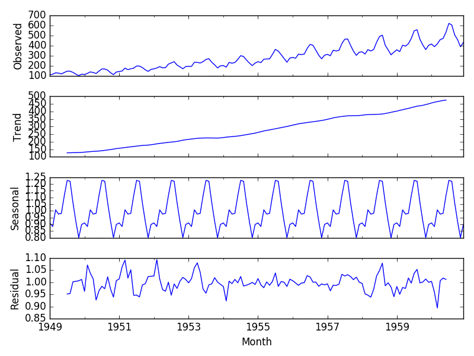
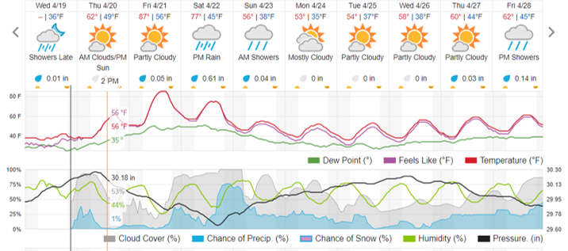
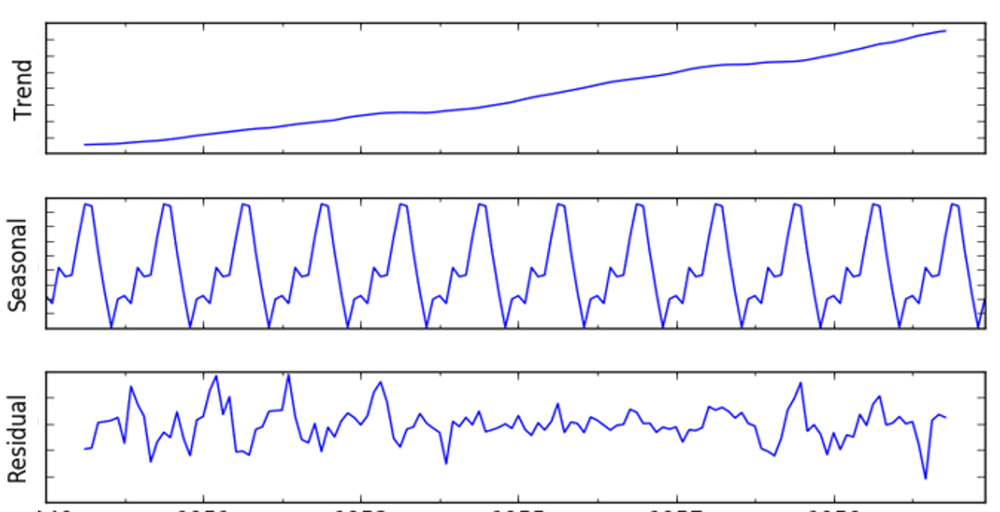

```{r setup, include=FALSE, echo=FALSE}
options(htmltools.dir.version = FALSE)
knitr::opts_chunk$set(
  fig.retina=2,
  #out.width = "75%",
  #out.height = "50%",
  htmltools.preserve.raw = FALSE,      # needed for windows
  scipen=100,                          # suppresses scientific notation
  getSymbols.warning4.0 = FALSE,       # suppresses getSymbols warnings
  cache = FALSE,
  echo = TRUE,
  hiline = TRUE,
  message = FALSE, 
  warning = FALSE
)


# install helper package (pacman)
# pacman loads and installs other packages, if needed
if (!require("pacman")) install.packages("pacman", repos = "http://lib.stat.cmu.edu/R/CRAN/")

# install and load required packages
# pacman should be first package in parentheses and then list others
pacman::p_load(pacman,tidyverse, magrittr, knitr, gridExtra, forecast, tidyquant, lubridate, maps, usdata, mapproj, ggthemes, RColorBrewer, dygraphs, climate)

# verify packages (comment out in finished documents)
p_loaded()


```

```{r xaringan-themer, include=FALSE, warning=FALSE}
library(xaringanthemer)

palette <- c(
  SU_Orange1        = "#F76900",
  SU_Orange2        = "#FF8E00",
  SU_Red_Orange     = "#FF431B",
  SU_Blue1          = "#000E54",
  SU_Blue2          = "#203299",
  SU_Light_Blue     = "#2B72D7",
  SU_White          = "#FFFFFF",
  SU_Light_Gray     = "#ADB3B8",
  SU_Medium_Gray    = "#707780",
  SU_Black          = "#000000", 
  
  steel_blue        = "#4682B4",
  corn_flower_blue  = "#6495ED",
  deep_sky_blue     = "#00BFFF",
  dark_magenta      = "#8B008B",
  medium_orchid     = "#BA55D3",
  lime_green        = "#32CD32",
  light_sea_green   = "#20B2AA",
  chartreuse        = "#7FFF00",
  orange_red        = "#FF4500",
  white_smoke       = "#F5F5F5",
  dark_cyan         = "#008B8B",
  light_steel_blue  = "#B0C4DE",
  indigo            = "#4B0082",
  ivory             = "#FFFFF0",
  light_slate_grey  = "#778899",
  linen             = "#FAF0E6",
  steel_blue        = "#4682B4",
  blue_violet       = "#8A2BE2",
  dodger_blue       = "#1E90FF",
  light_blue        = "#ADD8E6",
  azure             = "#F0FFFF",
  lavender          = "#E6E6FA")

primary_color = "#4682B4"                # steel_blue
secondary_color = "#778899"              # light_slate_grey
white_color = "#FFFFF0"                  # ivory
black_color = "#000080"                  # navy

style_duo_accent(
  primary_color = primary_color,
  secondary_color = secondary_color,
  white_color = white_color,
  black_color = black_color,
  text_color = black_color,
  header_color = primary_color,
  background_color = white_color,
  code_inline_background_color = "#E6E6FA", # lavender
  link_color = "#1E90FF",                   # dodger_blue
  code_inline_color = "#4B0082",            # indigo
  text_bold_color = "#8B008B",              # dark_magenta
  header_font_google = google_font("Open Sans"),
  text_font_google = google_font("Open Sans"),
  code_font_google = google_font("Source Code Pro"),
  colors = palette
)


```

```{r xaringan-panelset, echo=FALSE}
xaringanExtra::use_panelset()
```

```{r xaringan-tile-view, echo=FALSE}
xaringanExtra::use_tile_view()
```

```{r xaringan-fit-screen, echo=FALSE}
xaringanExtra::use_fit_screen()
```

```{r xaringan-tachyons, echo=FALSE}
xaringanExtra::use_tachyons()
```

```{r xaringan-animate-css, echo=FALSE}
xaringanExtra::use_animate_css()
```

```{r xaringan-animate-all, echo=FALSE}
#xaringanExtra::use_animate_all("slide_up")
```

background-image: url("docs_files/images/sloth_faded.png")
background-size: cover

class: bottom, right

## BUA 345 - Lecture 23

### Forecasting - Part 2 

<br>


#### Penelope Pooler Eisenbies

#### `r Sys.Date()`

[Wikipedia Sloth Page](https://en.wikipedia.org/wiki/Sloth)

---

### Reminders and Upcoming Dates

.pull-left[

- **Evaluations are VERY Important:**

  - **[coursefeedback.syr.edu](http://coursefeedback.syr.edu/)**
  
  - I will end class 5 min. early today and next Thursday to give you time to complete evaluations in class. 
  - Please complete evaluations for **ALL** courses.

- **HW 10 is due Monday, 4/24**

- **Optional Lecture on 4/25**

  - Developing R Functions for Time Series Analysis
  
- **Course Review on 4/27 (Required)** 

]

.pull-right[

```{r owl pic, echo=FALSE}

knitr::include_graphics("docs_files/images/owl.png")

```

]

---

### Reminder of Using R and R Markdown Files

.pull-left[

- Download Zipped R project 

- Open Zipped folder and copy internal folder (R Project) to a BUA 345 folder on your computer NOT IN DOWLOADS

- **Open R Project:**
  
  - *OPTION 1:* Click on .Rproj file to open project and RStudio

  - *OPTION 2:* Open RStudio, then click File > Open Project > then navigate to  and click on .Rproj file.
  

- **Once Project is opened in RStudio:**

  - Click on `code_data_output` file to open it.

  - Click on `BUA_345_Lecture_23.Rmd` to open it.

  - Run `setup` Chunk


]

.pull-right[

```{r beaver pic, echo=FALSE}

knitr::include_graphics("docs_files/images/beaver.png")

```

]

---

### Setup

.pull-left[

- The setup chunk shows the packages needed for this demo.   

- R will install specified packages if needed (only required once after R is installed)  

- R will load specified packaged (required every time you start a new R session)  

- The first time you run this code, R will install these packages which will be slow.  

- **If you get warnings, that's okay.**  

- If you get **error messages**, I (or TA), can help you.

]


.pull-right[

```{r owl pic2, echo=FALSE}

knitr::include_graphics("docs_files/images/owl.png")

```

]


---

### Setup Chunk for Lecture 23

```{r setup for Lecture 23, include = T}

# this line specifies options for default options for all R Chunks
knitr::opts_chunk$set(echo=T, highlight=T)
# suppress scientific notation
options(scipen=100)

# install helper package that loads and installs other packages, if needed
if (!require("pacman")) install.packages("pacman", repos = "http://lib.stat.cmu.edu/R/CRAN/")

# install and load required packages
pacman::p_load(pacman,tidyverse, magrittr, knitr, gridExtra, forecast, tidyquant, lubridate, maps, usdata, mapproj, ggthemes, RColorBrewer, dygraphs, climate)

# verify packages - it's a long list
#p_loaded()

```

**NOTES:**

- Please make sure you can open the provided R project for the practice questions and run the setup chunk without errors.
- If you are having trouble installing/loading any packages, please come to office hour or make an appointment with me or course TA.

---

### Plan for Today

- **Review of Time Series Concepts**

  - **Redemption for Syracuse!**
  
  - Review and New Terminology
  
- Review of Time Series without Seasonality

- Seasonality in Time Series Data

- Forecasting Trends with Seasonality in R

  - Example from HW 10: Alaska
  
 
#### HW Assignment 10

  - **Today:** Questions 7 - 10 
  
---

.pull-left[

#### Cross-Sectional Data

- Shows a Snapshot of One Time Period

```{r echo = F, message = FALSE, fig.align='center'}

gsb23 <- read_csv("gsb_23.csv", show_col_types = F, skip=25, 
                  col_select = c(1,2,6), ) |>
  slice(1:5) |>
  rename("city" = "...1", 
         "2022-23" = "...2", 
         "Most" = "...6") |> 
  
  mutate(Most = substr(Most, 1,5) |> as.numeric()) 

gsb_long <- gsb23 |> pivot_longer(cols = `2022-23`:Most, 
                               names_to = "type",
                               values_to = "inches") 
(gsb_plt <- gsb_long |>
  ggplot() +
  geom_bar(aes(x=city, y=inches, fill=type),
                stat="identity", position="dodge") +
  scale_fill_manual(values=c("blue4", "lightblue")) +
  theme_classic() +
  labs(fill="", x="City", y="Snowfall (inches)",
       caption="Data Source: https://goldensnowball.com/",
       title="City Snowfall - Current and All-time Record")+ 
  theme(plot.title = element_text(size = 15),
        plot.caption = element_text(size = 10),
        axis.title.x = element_text(size = 15),
        axis.title.y = element_text(size = 15),
        axis.text.x = element_text(size = 8),
        axis.text.y = element_text(size = 15),
         plot.background = 
          element_rect(colour = "darkgrey", fill=NA, size=2)))


```

]

.pull-right[

#### Time Series Data

- Shows Trend over Time

```{r syr snowfall timeseries, echo=F, message=F, fig.align='center'}

snowfall <- read_csv("snowfall_upstateny_cities.csv", 
                     show_col_types = F) |>
  filter(!Season=="Season") |>
  separate(Season, into=c("Season_Start", "Season_End"), sep = "-") |>
  mutate(Season_Start = Season_Start |> as.integer(),
         Season_End = Season_Start + 1 |> as.integer(),
         Syracuse = Syracuse |> as.numeric(), 
         Buffalo = Buffalo |> as.numeric()) |>
  rename("city_most" = "City With Most Snow") |>
  select(Season_End, Syracuse, Buffalo, city_most) |>
  filter(Season_End >= 1952) |>
  pivot_longer(cols=Syracuse:Buffalo, names_to = "City", values_to = "Snowfall") 
   
(line_plot <- snowfall |>
  ggplot() +
  geom_line(aes(x=Season_End, y=Snowfall, color=City), linewidth=1) +
  theme_classic() + 
  scale_x_continuous(breaks=seq(1960, 2020, 10)) + 
  scale_color_manual(values=c("lightblue", "blue")) +
  ylim(0,200) +
  
  labs(title="Syracuse Annual Snowfall", 
       y="Snowfall (inches)", 
       x="Year Season Ended", 
       caption="Data Source: https://en.wikipedia.org/wiki/Golden_Snowball_Award") + 
  theme(plot.title = element_text(size = 15),
        plot.caption = element_text(size = 10),
        axis.title.x = element_text(size = 15),
        axis.title.y = element_text(size = 15),
        axis.text.x = element_text(size = 10),
        axis.text.y = element_text(size = 15),
         plot.background = 
          element_rect(colour = "darkgrey", fill=NA, size=2)))

```

]

---

### Time Series Terminology

--

- **auto-correlation:** A variable is correlated with itself
  
- **auto-regression (AR):** Using previous observations to predict into the future.
  
- **R function:** **`auto.arima` - ARIMA** is an acronym:

  - **AR:** auto-regressive - `p` = number of lags to minimize auto-correlation
  
  - **I:** integrated - `d` = order of differencing to achieve stationarity
  
  - **MA:** moving average - `q` = number of terms in moving average   
  
  - All 3 components are optimized to provide a reliable forecast.
  
---

### More on Stationarity

- **Stationary Time Series:**
 
  - Consistent mean and variance throughout time series
  
  - Time series with trends, or with seasonality, are not stationary.
  
  - Separating a time series into different parts is how we analyze it
  
    - This is called **DECOMPOSITION**
    
    - Time Series Modeling decomposes the data into:
    
      - Trend
      
      - Seasonality (repeated pattern)
      
      - Residuals (what's left over)
    
---

### Decomposition and SARIMA Models

#### **NEW TERM: SARIMA model**

  - Lecture 22: **ARIMA** models
  
  - Today: ARIMA models with **SEASONAL** component.
  
  - **SARIMA:** **S**easonal **A**uto-**R**egressive **I**ntegrated **M**oving **A**verage.

--

- **SARIMA** models: 

  - optimize `p`, `d`, and `q` for whole time series 

  - Also optimize `p`, `d`, and `q` within season (repeating intervals)

--

#### **Decomposition**

- ARIMA models are decomposed into 

  - Trend | Residuals
  
- SARIMA models are decomposed into

  - Trend | Seasonal patterns | Residuals

---

### Visualization of Decomposition:

.pull-left[]


.pull-right[

- **ARIMA:** 

 - 2nd Plot looks similar to Population Time Series
 
 - ARIMA decomposes trend into: 
 
     - Trend (2nd Plot)
     - Residuals (4th Plot)
     
- **SARIMA:** 

  - Plot 1: Time Series with a seasonal pattern.
  
  - SARIMA decomposes trend into: 
  
     - Trend (2nd Plot)
     - Seasonality (3rd Plot)
     - Residuals (4th Plot)

]

---

### Netflix Stock Prices - Review

- Dashed lines show peaks at irregular intervals.

```{r dygraph nflx data, echo=F, message=F, fig.dim=c(15,7), fig.align='center'}
# import from yahoo finance and plot hchart
nflx <- getSymbols("NFLX", from = "2010-01-01", to = "2023-04-19")


(nflx_dyg <- NFLX[,6] |>
    dygraph(main="Netflix: Non-Seasonal Trending Data") |>
    dySeries("NFLX.Adjusted", "NFLX", color="red") |>
    dyRangeSelector() |>
    
# remove grid lines and label axes to make plot more readable (optional)
  dyAxis("y", label = "Adjusted Close", drawGrid = FALSE) |>
  dyAxis("x", label = "Date", drawGrid = FALSE) |>
    
# add lines for events

  dyEvent("2014-2-1", color="lightblue") |>
  dyEvent("2014-8-1", color="lightblue") |>
  dyEvent("2015-8-1", color="lightblue") |>
  dyEvent("2015-11-1", color="lightblue") |>
  dyEvent("2018-6-1", color="lightblue") |>
  dyEvent("2018-8-1", color="lightblue") |>
  dyEvent("2019-4-1", color="lightblue") |>
  dyEvent("2019-6-1", color="lightblue") |>
  dyEvent("2020-8-1", color="lightblue") |>
  dyEvent("2021-1-1", color="lightblue") |>
  dyEvent("2021-11-1", color="lightblue"))


```


---

### Netflix Stock 

```{r echo=F, message=F}

nflx <- NFLX |> # convert xts to tibble and filter to first trading day of each month
  fortify.zoo() |> as_tibble(.name_repair = "minimal") |>
  rename("Date" = "Index", "Adjusted" = "NFLX.Adjusted") |>
  mutate(year=year(Date), month=month(Date)) |>
  group_by(year, month) |>
  filter(Date == min(Date)) |>
  ungroup() |>
  select(Date, Adjusted)


```

--

#### Netflix Forecast (Monthly Adjusted Close)
    
- Create Netflix Monthly Time Series Data for Model: 

  - `freq = 12` and `start = c(2010,1)`

```{r create nflx time series}
nflx_ts <- ts(nflx$Adjusted, freq=12, start=c(2010,1))
```

--

- Specify Model:

  - `auto.arima` with `ic=aic` and `seasonal=F`
  
```{r specify nflx model}
nflx_model <- auto.arima(nflx_ts, ic="aic", seasonal=F)
```

--

- Use Model to Forecast

  - Forecasts requested for 12 months: `h=12` 

```{r create nflx forecasts}
nflx_forecast <- forecast(nflx_model, h=12)
```

---

### Netflix Stock - Forecast Plot 

- Darker purple: 80% Prediction Interval Bounds    Lighter purple: 95% Prediction Interval Bounds
- Plot shows: Lags (`p = 2`), Differencing (`d = 1`), Moving Average (`q = 2`)

```{r plot nflx forecasts with pred intervals, fig.dim=c(10,5), fig.align='center'}

autoplot(nflx_forecast) + labs(y = "Adjusted Closing Price") + theme_classic() + 
  theme(plot.background = element_rect(colour = "darkgrey", fill=NA, size=2))

```

---

### Netflix: Prediction Intervals

- Point Forecast is the forecasted estimate for each future time period

- Lo 80 and Hi 80 are the lower and upper bounds for the 80% prediction interval

- Lo 95 and Hi 95 are the lower and upper bounds for the 95% prediction interval


```{r nflx numerical forecasts}
nflx_forecast
```

---

### Model Accuracy: 100 - MAPE = Model's Percent Accuracy

```{r nflx fit statistics, results='hide'}    
(acr <- accuracy(nflx_forecast))
```

--

- **For BUA 345:** We will use MAPE = Mean Absolute Percent Error

  - **100 – MAPE = Percent accuracy of model.**

- Despite increasing volatility, our stock price model is estimated to be `r round(100 - acr[5],2)`% accurate.

- This doesn’t guarantee that forecasts will be `r round(100 - acr[5])`% accurate but it does improve our chances of accurate forecasting.

---

### Netflix Stock - Examine Residuals and Model Fit

.pull-left[

```{r nflx residual plots, fig.dim=c(5,6)}
# examine residuals
checkresiduals(nflx_forecast)

```
]

.pull-right[

#### Examining Residuals:

  - Top Plot: Spikes get larger over time 
  
  - ACF: auto-correlation function.
  
    - Ideally, all or most values are with dashed lines
    
  - Histogram: Distribution of residuals should be approx. normal
  
    - Appears okay
    
  - Assessment: Stock prices are very volatile and this is sufficient.
]

---


### Seasonality - Not Just Seasons
- Seasonal periods can be days, months, seasons, decades, etc.
- Seasonality: repeating pattern of highs and lows of approx. equal timespans

#### **Example: Temperature data has a daily seasonal pattern:**

```{r echo=FALSE, fig.align='center', out.width="75%"}



```


---

### Seasonality - Not Just Seasons
- Seasonal periods can be days, months, seasons, decades, etc.
- Seasonality: repeating pattern of highs and lows of approx. equal timespans

#### Carbon Dioxide Trends - Monthly - 1958 to Present Day

```{r import co2 data, echo=F, include=F, message=FALSE, results='hide'}
co2 <- read_csv("co2.csv") |>
  select(1,2,4,5) |>
  mutate(date=ymd(paste(yr,month,15))) |>
  glimpse()

# https://gml.noaa.gov/webdata/ccgg/trends/co2/co2_mm_mlo.txt

# https://gml.noaa.gov/dv/data/index.php?parameter_name=Carbon%2BDioxide&site=MLO%22

```

```{r co2 trends, echo=F, message=F, fig.dim=c(10,5.5), fig.align='center'}

(co2_plot <- co2 |>
  ggplot() +
  geom_line(aes(x=date, y=mnth_avg), color="blue", linewidth=1) +
  theme_classic() +
  labs(title="Carbon Dioxide Measurements (1958 - 2023)", 
       subtitle="Monthly Data from Mauna Loa Observatory, Hawaii, USA",
       y="Carbon Dioxide (ppm)", 
       x="Date", 
       caption="Data Source: https://gml.noaa.gov/webdata/ccgg/trends/co2/co2_mm_mlo.txt") + 
  scale_x_date(breaks = "10 years", date_labels = "%Y") +
  theme(plot.title = element_text(size = 15),
        plot.caption = element_text(size = 8),
        axis.title.x = element_text(size = 15),
        axis.title.y = element_text(size = 15),
        axis.text.x = element_text(size = 10),
        axis.text.y = element_text(size = 15),
        plot.background = element_rect(colour = "darkgrey", fill=NA, size=2)))


```

---

### Seasonality - Not Just Seasons
- Seasonal periods can be days, months, seasons, decades, etc.
- Seasonality: repeating pattern of highs and lows of approx. equal timespans

#### Carbon Dioxide - Monthly - 2014 to Present Day 

```{r recent co2 trends, echo=F, message=F, fig.dim=c(10,5.5), fig.align='center'}
co2_1 <- co2 |> filter(yr >= 2014)

(co2_plot1 <- co2_1|>
  ggplot() +
  geom_line(aes(x=date, y=mnth_avg), color="blue", linewidth=1) +
  theme_classic() +
  labs(title="Carbon Dioxide Measurements (2014 - 2023)", 
       subtitle="Monthly Data from Mauna Loa Observatory, Hawaii, USA",
       y="Carbon Dioxide (ppm)", 
       x="Date", 
       caption="Data Source: https://gml.noaa.gov/webdata/ccgg/trends/co2/co2_mm_mlo.txt") + 
  scale_x_date(breaks = "1 year", date_labels = "%Y") +
  theme(plot.title = element_text(size = 15),
        plot.caption = element_text(size = 8),
        axis.title.x = element_text(size = 15),
        axis.title.y = element_text(size = 15),
        axis.text.x = element_text(size = 10),
        axis.text.y = element_text(size = 15),
        plot.background = element_rect(colour = "darkgrey", fill=NA, size=2)))


```

---

#### Seasonality and Trend

.pull-left[

```{r smaller co2 plot, echo=F, fig.dim=c(5,3)}

(co2_plot2 <- co2_1|>
  ggplot() +
  geom_line(aes(x=date, y=mnth_avg), color="blue", linewidth=1) +
  theme_classic() +
  labs(title="CO2 (2014 - 2022)",
       y="Carbon Dioxide (ppm)", 
       x="Date") + 
  scale_x_date(breaks = "1 year", date_labels = "%Y") +
  theme(plot.title = element_text(size = 15),
        axis.title.x = element_text(size = 15),
        axis.title.y = element_text(size = 15),
        axis.text.x = element_text(size = 10),
        axis.text.y = element_text(size = 15),
        plot.background = element_rect(colour = "darkgrey", fill=NA, size=2)))

```

**Data above are decomposed into these components:**


]

.pull-right[

-  Plot shows BOTH
   - Upward Trend
   - Seasonal Pattern  
   
- Forecasting model is specified to account for both components

<br>

- Forecasting decomposes data into

<br>

  - **Trend**
  
<br>

  - **Seasonality**
  
<br>

  - **Residuals**
 
]


---

### Seasonal Data: Alaska Electricity Revenue

.pull-left[

**Alaska is very far north** so there is

- ***summer light*** (day and night)

- ***winter darkness*** (day and night)

Alaska Electricity usage has a **strong** seasonal pattern.

**Data range for Lecture 23**
- Start: 	First quarter of 2001
- End: 	  Last quarter of 2022 (HW 10 data end in 2021)

In addition to seasonality, we expect an upward trend in revenue due to:
- Increase in population
- Inflation of electricity prices
]

.pull-right[]


---

### Seasonal Data: Alaska Electricity Revenue (2002 - 2022)

**Notes: Lecture 23 data were updated through 2022 but HW 10 Alaska data end in 2021**

```{r import examine ak data, echo=F, message=F}
# a little data mgmt (if you are interested)
ak_res <- read_csv("AK_Residential_Electricity_Revenue_Updated.csv", 
                   show_col_types = F,
                   skip=5, 
                   col_names = c("quarter","Revenue")) |>
  separate(quarter, c("Quarter", "Year")) |>
  mutate(Date=yq(paste(Year, Quarter))) |>
  select(Date, Revenue) |>
  arrange(Date) |>
  glimpse(width=50)

```

--

#### **Alaska Residential Electricity Time Series**

```{r ak_res to xts and plot, echo=F, fig.dim=c(15,4.5), fig.align='center'}

# convert to xts (extensible time series)
ak_res_xts <- xts(x = ak_res[,2], order.by = ak_res$Date)

# ak-res interactive time_series
(ak_dg <- dygraph(ak_res_xts, main="Alaska Residential Electricity Revenue ($Mill)") |>
    dySeries("Revenue", label="Revenue", color= "purple") |>
    dyAxis("y", label = "", drawGrid = FALSE) |>
    dyAxis("x", label = "", drawGrid = FALSE) |>
    dyRangeSelector())
  
```

---

### **Alaska Residential Time Series**  

--
- Create Time Series and Examine it:   

```{r create ak time series}
# create time series using ts command
ak_res_ts <- ts(ak_res$Revenue, freq=4, start=c(2001, 1))
```

--

- Format of Time Series with Quarters:

  - Specifying time series this way formats data as a matrix.

  - `head(ak_res_ts, 20)` shows first 20 observations and format.

```{r head used to show ts format}
head(ak_res_ts, 20)
```

---

### Lecture 23 In-class Exercises - Session ID: bua345s23

#### Question 1 (L23) - Specifying a Time Series   

--

If our time series from Alaska were augmented so that it started in February of 1990 (2nd month) and we had data by month (12 observations per year), how would our ts command change in R?

Hint: Our current data, `ak_res` are quarterly, and begin in January of 2001. The command we used to create time series is:

**`ts(ak_res$Revenue, freq=4, start=c(2001,1))`**

<br>

A. `ts(ak_res$Revenue, freq=1, start=c(1, 1990))`

B. `ts(ak_res$Revenue, freq=4, start=c(2, 1990))`

C  `ts(ak_res$Revenue, freq=12, start=c(1990, 2))`

D.  `ts(ak_res$Revenue, freq=12, start=c(2, 1990))`

E.  `ts(ak_res$Revenue, freq=4, start=c(1, 1990))`

---

### **Alaska Residential Electricity Time Series**

#### **Incorrect Model: Ignores Seasonality (`seasonal = F`)**

- Notice how wide prediction intervals are.
- Model only optimizes `p`, `d`, and `q` for full time series `(0,1,0)`.

```{r incorrect model plt lg, message=F, fig.dim=c(8,3)}
ak_res_forecast1 <- ak_res_ts |> 
  auto.arima(ic="aic", seasonal=F) |>
  forecast(h=4)
(autoplot(ak_res_forecast1) + labs(y = "AK Resid. Elec. Revenue") + theme_classic())
```

---

### **Alaska Residential Electricity Time Series**

#### **Correct Model: Includes Seasonality (`seasonal = T`)**

- Prediction intervals are **MUCH** more narrow
- Optimizes `p`, `d` and `q` for full time series `(1,0,0)` and within season `(0,1,1)`.
- Indicates number of time periods within season, `[4]`

```{r correct model plt lg, message=F, fig.dim=c(8,3)}
ak_res_forecast2 <- ak_res_ts |> 
  auto.arima(ic="aic", seasonal=T) |>
  forecast(h=4) 
(autoplot(ak_res_forecast2) + labs(y = "AK Resid. Elec. Revenue") + theme_classic())
```

---

### Lecture 23 In-class Exercises - Session ID: bua345s23

#### Question 2 (L23) - Requesting forecasts 

--

Our data is quarterly and has four observations per year ending in the 4th quarter of 2022.  

**If the state of Alaska wants to extend the forecast until the Fall of 2024 (3rd Quarter), how would they change the R command?**

Hint: Current forecast extends until the 4th quarter of 2023 and command is written as:

**`forecast(ak_res_model2, h=4)`**

--
<p>&nbsp;</p>

A. `forecast(ak_res_model2, h=6)`

B. `forecast(ak_res_model2, h=7)`

C. `forecast(ak_res_model2, h=8)`

D. `forecast(ak_res_model2, h=9)`

E. `forecast(ak_res_model2, h=10)`

---

#### **Side by Side Comparison: Incorrect and Correct**

--

.pull-left[
#### **Incorrect Model: LESS PRECISE**
```{r incorrect model plt sm, echo=F, message=F, fig.dim=c(5,3)}
(autoplot(ak_res_forecast1) + labs(y = "AK Resid. Elec. Revenue") + theme_classic())
```


```{r incorrect model forecasts, echo=F, message=F}
out1 <- round(bind_cols(ak_res_forecast1$mean, 
                  ak_res_forecast1$lower, ak_res_forecast1$upper),2) |>
  rename("Pt" = "...1", "Lo80"="80%...2", "Lo95"="95%...3", 
         "Hi80"="80%...4", "Hi95"="95%...5") |>
  mutate(Year = 2023,
         Qtr = 1:4) |>
  select(Year, Qtr, "Pt", "Lo95", "Hi95") 
  
knitr::kable(out1, format = 'html', )

```

**`Q4 Width = Hi - Lo = $130`**

]

--

.pull-right[
#### **Correct Model: MORE PRECISE**
```{r correct model plt sm , echo=F, message=F, fig.dim=c(5,3)}
(autoplot(ak_res_forecast2) + labs(y = "AK Resid. Elec. Revenue") + theme_classic())
```


```{r correct model forecasts, echo=F, message=F}
out2 <- round(bind_cols(ak_res_forecast2$mean, 
                  ak_res_forecast2$lower, ak_res_forecast2$upper),2) |>
  rename("Pt" = "...1", "Lo80"="80%...2", "Lo95"="95%...3", 
         "Hi80"="80%...4", "Hi95"="95%...5") |>
  mutate(Year = 2023,
         Qtr = 1:4) |>
  select(Year, Qtr, "Pt", "Lo95", "Hi95") 
  
knitr::kable(out2, format = 'html', )
```

**`Q4 Width = Hi - Lo = $18`**

]

---
### Prediction Bands Indicate Model Precision

--

- Prediction bands are MUCH narrower when seasonality is accounted for.

--

#### Incorrect Model Forecasts and Prediction Bounds
```{r incorrect model forecasts full, echo=F, message=F}
ak_res_forecast1
```

--

#### Correct Model Forecasts and Prediction Bounds
```{r correct model forecasts full, echo=F, message=F}
ak_res_forecast2
```


--

- **Interpretation of 95% Prediction Bounds:**
--
  
- We are 95% certain that 4th qtr. revenue in 2023 will fall within:

  - Incorrect model range: **`$195.07 - $64.81 = $130`**
  - Correct model range:   **`$143.45 - $125.50 = $18`**

---

#### Comparison of Model Residuals
--

.pull-left[
```{r incorrect residuals, echo=F, fig.dim=c(6,5)}
checkresiduals(ak_res_forecast1, test=F)
```

**Incorrect Model:**  
- Residuals **MUCH** larger
- Are highly correlated 
  - See ACF plot
- Residual plots indicate model is **INCORRECTLY** specified and invalid.
]

--

.pull-right[

```{r correct residuals, echo=F, fig.dim=c(6,5)}
checkresiduals(ak_res_forecast2, test=F)
```

**Correct Model:**  
- Residuals **MUCH** smaller
- Auto-correlation assumption is met
  - ACF plot: lags in range
-  Residual plots indicate model is **CORRECTLY** specified and valid.
]


---
### Comparison of Model Accuracy

--
```{r incorrect model accuracy}
(acr1 <- accuracy(ak_res_forecast1))
```

- **The incorrect model's percent accuracy is `r round(100-acr1[5],1)`%.**

- Better than expected.

--
```{r correct model accuracy}
(acr2 <- accuracy(ak_res_forecast2))
```

- **The correct model's percent accuracy is `r round(100-acr2[5],1)`%.**

- Always plot data, but if seasonality is difficult to discern, run both models and compare them.

- Residuals (previous slide) and model accuracy (this slide) of models will indicate which model is correct.

---

background-image: url("docs_files/images/tired_panda_faded.png")
background-size: cover

.pull-left[

### Key Points from Today

.bg-azure.b--dark_cyan.ba.bw2.br3.shadow-5.ph2[

- **`R forecast package`** - simplifies forecasting**

- **Know terminology and how to read and interpret output.**

- **Plot data FIRST:** - Check for seasonality, trend, other patterns
  
- **HW 10 covers Lectures 21-23 (Due Mon. 4/24)**
  
- **Lecture 24 (Tue. 4/25) - Optional**
  - Developing Time Series Functions in R
  
- **Lecture 25 - Required Review:** 
  - 20 min. of lecture with Point Solutions, then Q&A - Come with questions!
  
- **Evaluations are VERY Important:**
  - **[coursefeedback.syr.edu](http://coursefeedback.syr.edu/)**

]

]

.pull-right[

.bg-azure.b--dark_cyan.ba.bw2.br3.shadow-5.ph3[
You may submit an 'Engagement Question' about each lecture until midnight on the day of the lecture. **A minimum of four submissions are required during the semester.**
]

]


